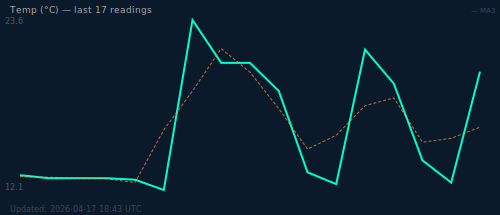

# 🚀 LA Weather  Automet

<p align="left">
  
  
  
  
  
</p>

A zero-cost CI/CD automation pipeline that fetches real weather data for Los Angeles every 6 hours, runs analysis logic, generates a live SVG chart, and publishes results to a GitHub Pages dashboard — fully automated with no servers, no secrets, and no spend.

---

## 🌐 Live Dashboard

👉 **[nattapongsindhu.github.io/la-weather-automet](https://nattapongsindhu.github.io/la-weather-automet/)**

---

## 📈 Temperature History



> SVG updates every 6h via pipeline. For interactive chart with full history → [Live Dashboard](https://nattapongsindhu.github.io/la-weather-automet/)

---

## ⚙️ How It Works

```
GitHub Actions (cron: every 6h)
  └── Fetch    → Open-Meteo API (LA weather, no key required)
  └── Analyze  → Python: status classification + trend detection
  └── Score    → Heat index formula (0–100)
  └── Update   → temp.csv · data.json · graph.svg · history.txt
  └── Commit   → auto-push to main → GitHub Pages redeploys
```

**Stack:** Bash · Python 3 · jq · Chart.js · GitHub Actions · GitHub Pages

---

## 📁 File Structure

| File | Purpose |
|------|---------|
| `.github/workflows/simulate.yml` | Main automation pipeline |
| `data.json` | Latest weather snapshot + analysis |
| `temp.csv` | Historical temperature log |
| `graph.svg` | Auto-generated SVG chart (last 20 readings) |
| `index.html` | Live dashboard (Chart.js) |
| `history.txt` | Structured audit log (timestamp, temp, wind, status, trend, score) |
| `weather.json` | Raw API response |

---

## 🧠 Analysis Logic

| Condition | Status | Color |
|-----------|--------|-------|
| temp > 30°C | HOT | 🔴 |
| temp > 20°C | WARM | 🟡 |
| temp < 5°C | COLD | 🔵 |
| otherwise | OK | 🟢 |

Trend compares current temp against the previous reading (±1.5°C threshold → Rising / Falling / Stable).  
Score = `min(100, temp × 2 + wind × 0.5)`

---

## 🔒 Security & Cost

- No API keys or secrets required
- Uses [Open-Meteo](https://open-meteo.com/) — free, open, no auth needed
- Runs 4×/day = ~120 workflow runs/month (well within free tier limits)
- All committed data is plain text and fully auditable

---

## 💡 What This Demonstrates

- GitHub Actions scheduling and workflow design
- Data pipeline: fetch → parse → transform → store → visualize
- Python scripting embedded in shell workflows
- Zero-infrastructure, zero-cost automation
- GitHub Pages as a free hosting layer

---

<p align="center">⚡ Built for Portfolio + Automation Engineering</p>
